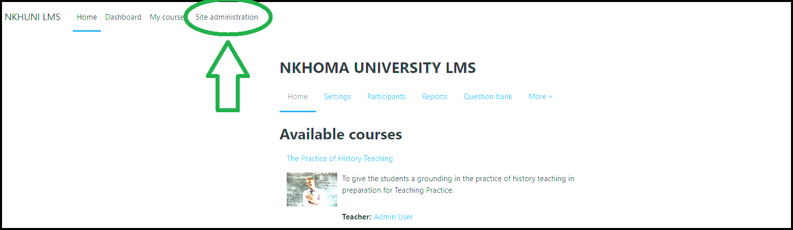
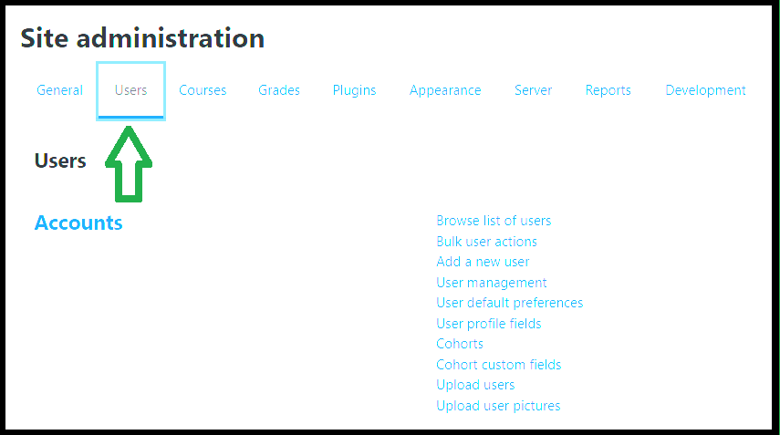
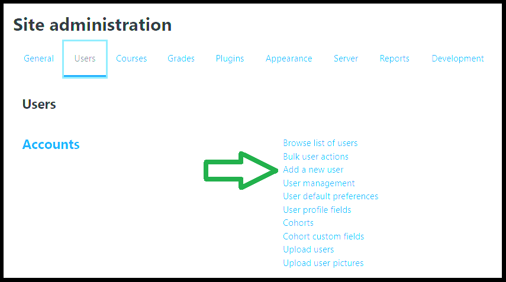
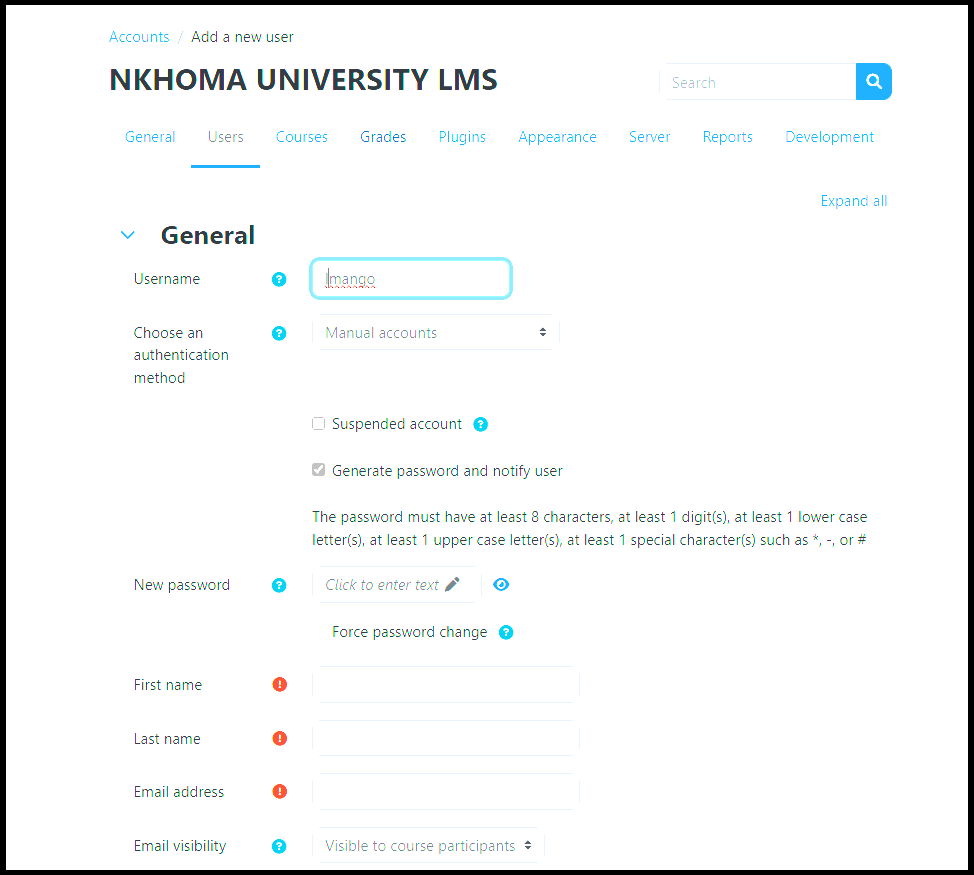
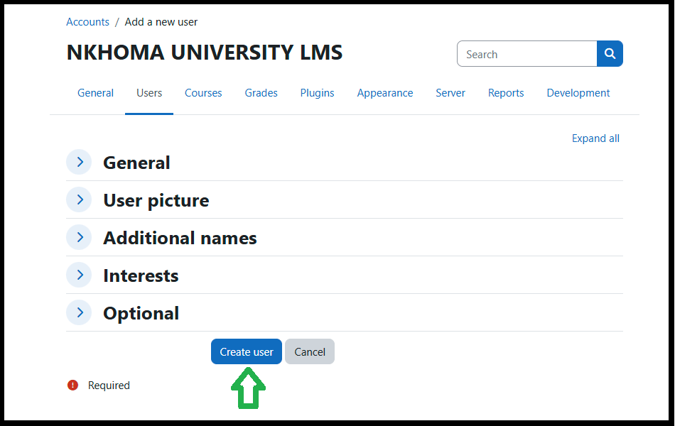

# Create and Activate Student Accounts

---

In order to use the Moja application, students must first have an account.

To create an account for a student, follow the steps outlined below. 

## Access the *Site Administration* Page

In order to create a student account, you must access the site administration page.  
This is where all work concerning administrative actions takes place. 

!!! warning "Check Your Permissions!"

    If you don't have the proper administrative permission set, you will be unable to create users!  
    If you believe you should have these permissions and do not, **contact your Moja representative** for assistance!

## Navigate To the *Add a New User* Pane

Following the images below, first select the Users pane from the list of administrative areas.

And then select *Add a New User* From the list of User actions.

You're now ready to begin creating a new user!

## Create and Add a New User

You've reached the user information fields which should look something like the image below.
Proceed through the fields, adding the user's information until you reach the end of the form.

!!! warning "Required Fields"

    You must fill in all required fields in order to successfully create the user!  
    These required fields will be indicated by a red circular icon with an exclamation mark in its center.

Once you have finished filling in the user's information, press the Create User button at the end of the form to confirm.  
This will finalize the creation of the user, although you'll be able to edit the user later if certain details require adjustment.

## Finalize User Creation

!!! warning "Remember to press *Create User*"

    If you navigate away from this page before finalizing your user, your work will be lost.